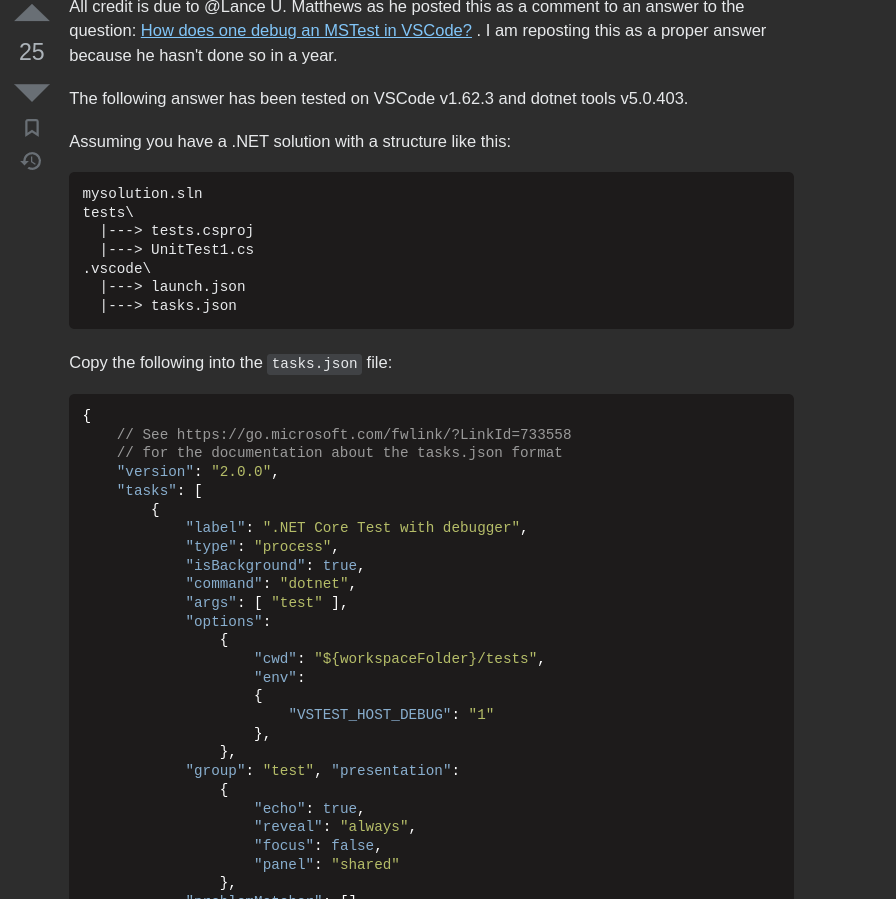
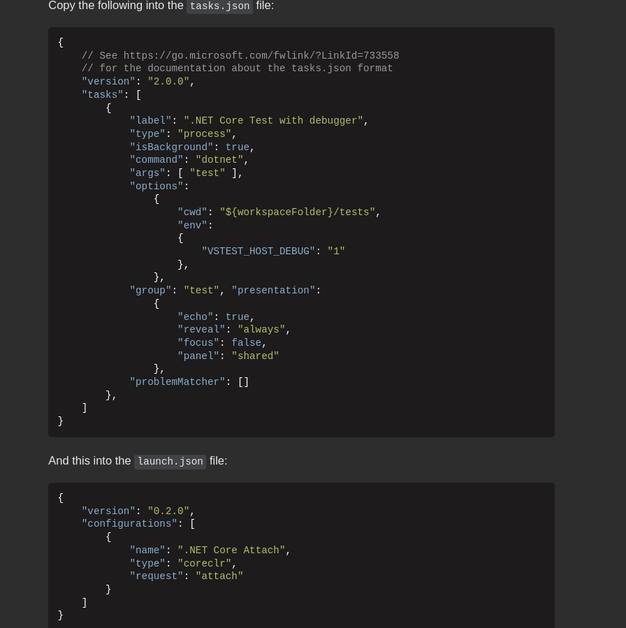
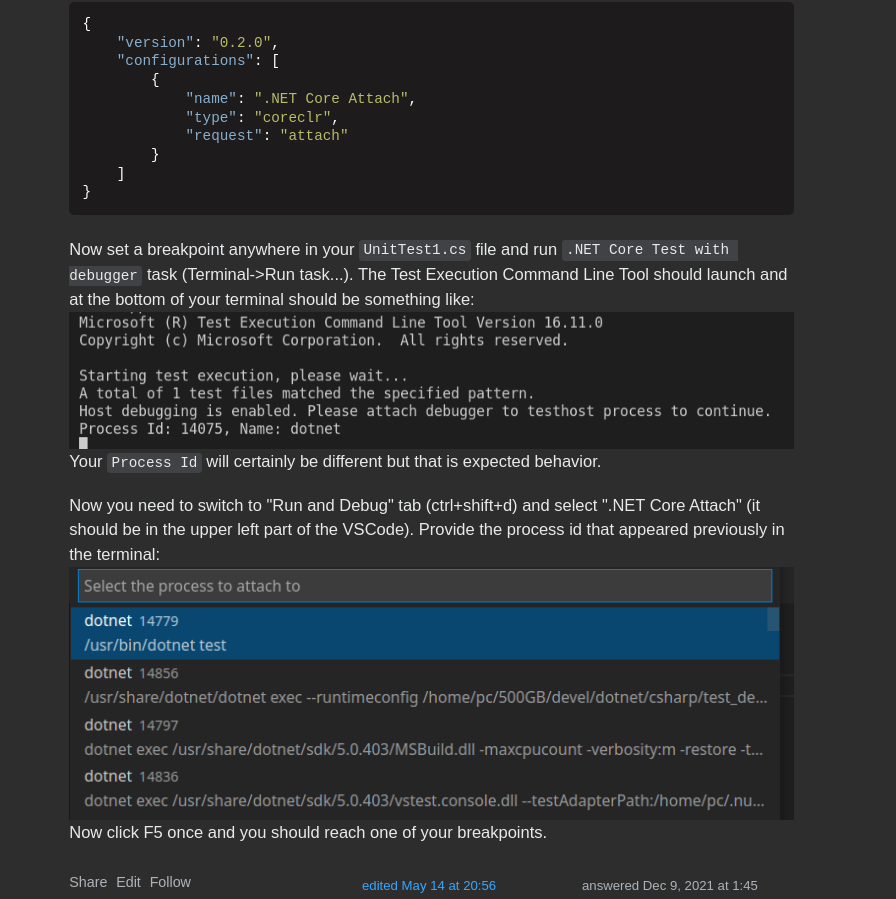

# Reference For Debug
- [stackoverflow](https://stackoverflow.com/questions/56290166/how-to-debug-dotnet-test-in-vs-code)

# with images

- You can find original answer in link [`here`](#reference-for-debug)
1. Edit `tasks.json`


2. Edit `launch.json`


3. First Run task, then attach to debugger


# Output Should Be like

```shell
Assembly Initialize
Class Initialize
Test Initialize
Test Method 1 ..............
Test Cleanup
Test Initialize
Test Method 2 ..............
Test Cleanup
Class UnitTest2 Initialize
Test UnitTest2 Initialize
Test Method 3 ..............
Test UnitTest2 Cleanup
Test UnitTest2 Initialize
Test Method 4 ..............
Test UnitTest2 Cleanup
Class UnitTest2 Cleanup
Class Cleanup
Assembly Cleanup
```
